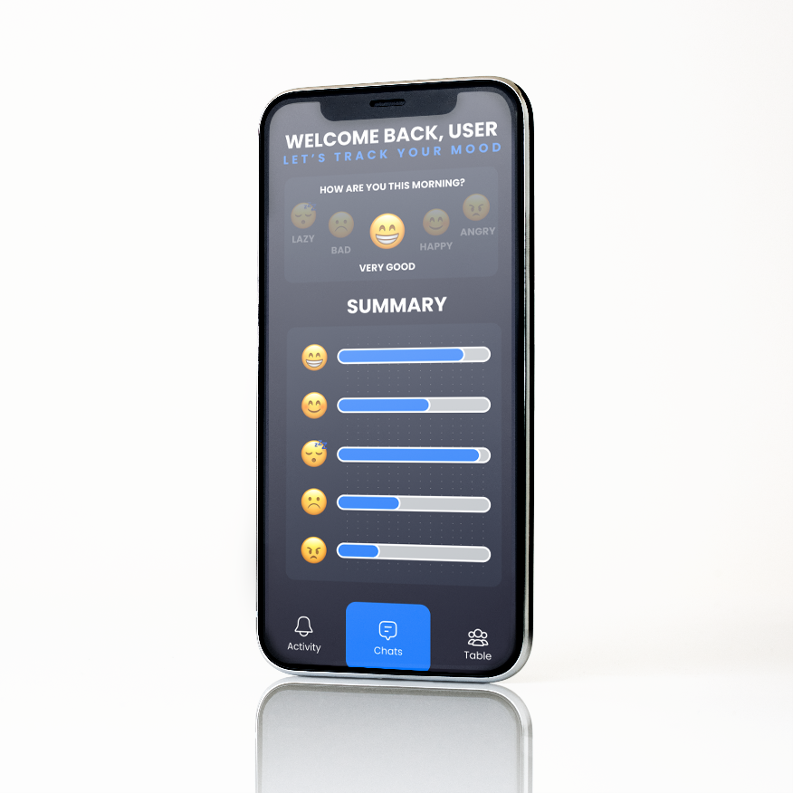
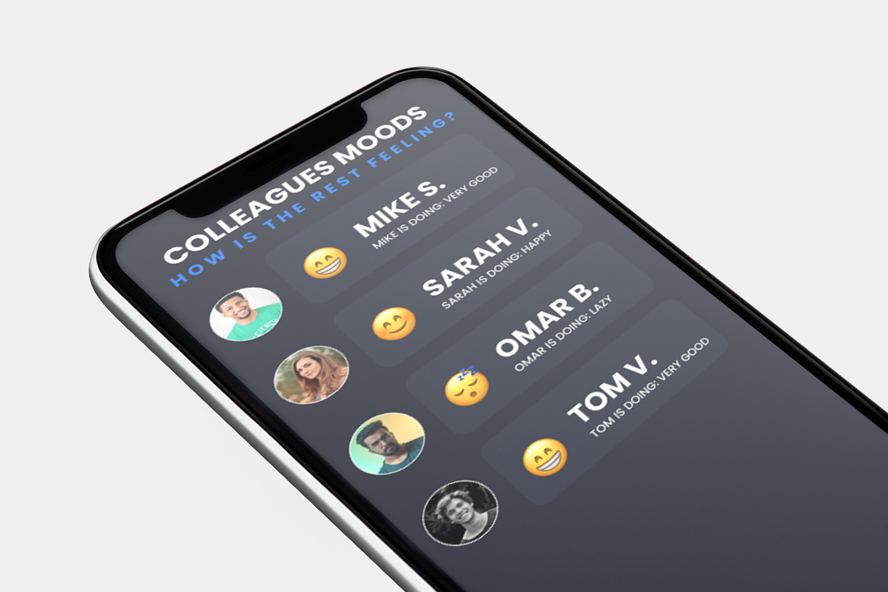

# Effienct Remote Working

## Project Overview

Remote workers are often met with challenges. After communication with our stakeholders we noticed that communication between the employees was one of the main ones. Our purpose was to create a mobile solution for the lack of communication.

## Project Scope

Our mobile solution consists 3 pages. The first page is the Home page where you can fill in your own mood and see a summary of your own moods. Secondly we have the Moods page where you can see the moods of your colleagues. Thirdly you get to the final page which is the Table page which is supposed to represent a coffee table where you can have a chat with your colleagues.

## Prototypes

If you want to see the prototype in action, click [here](https://www.figma.com/file/crZXBvnwvBReC5GO1RuGAu/Justin's-Prototype-Remote-Working).

## Contributors

-   [Justin Veenhuis](https://github.com/jraemakers)
-   [Joost Raemakers](https://github.com/Justin509805)
